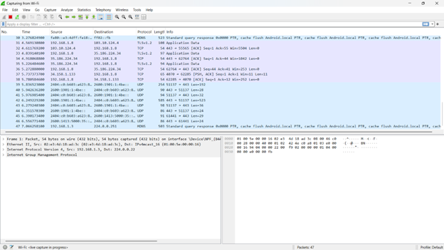
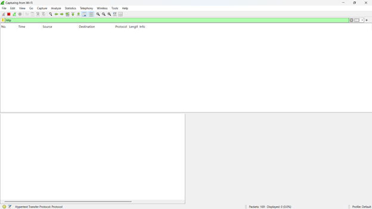
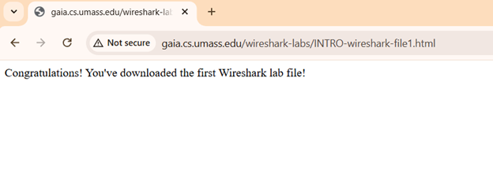
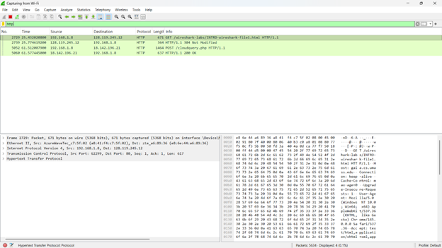
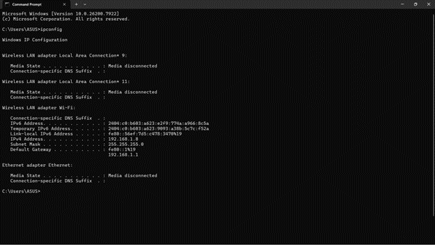

# laporan Praktikum Jaringan komputer 
# Modul 1
## langkah Percobaan
1. install iso wireshark
2. download wireshark
3. lanjut buka wireshark

## Lampiran
Pertama, buka wireshark pencet dua kali tulisan “wifi”:

Setelah masuk, lalu ketik http

Setelah itu pencet link http://gaia.cs.umass.edu/wireshark-labs/INTRO-wireshark-file1.html

Setelah di pencet link tersebut, kembali buka wireshark, Hasilnya:

Setelah itu buka cmd ketik "ipconfig"
