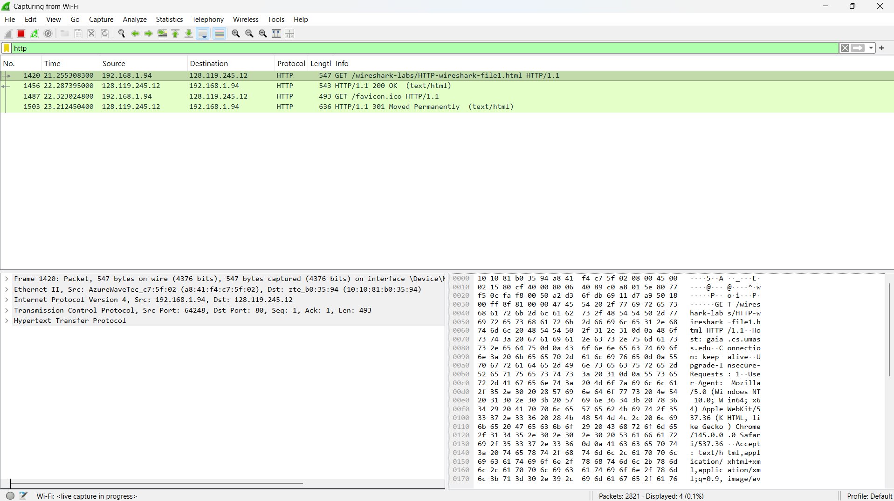
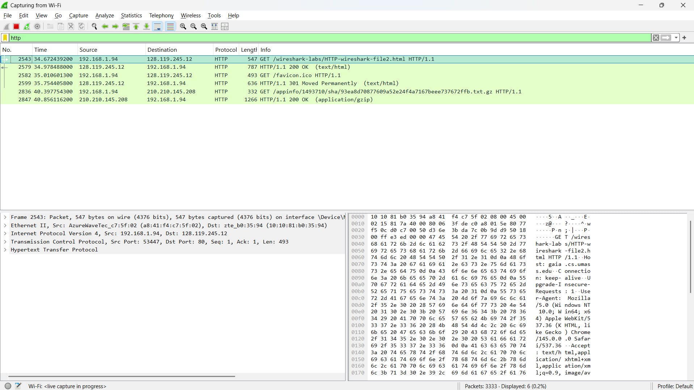
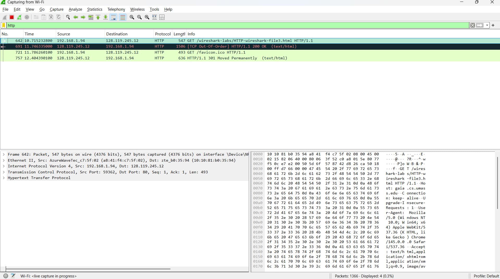
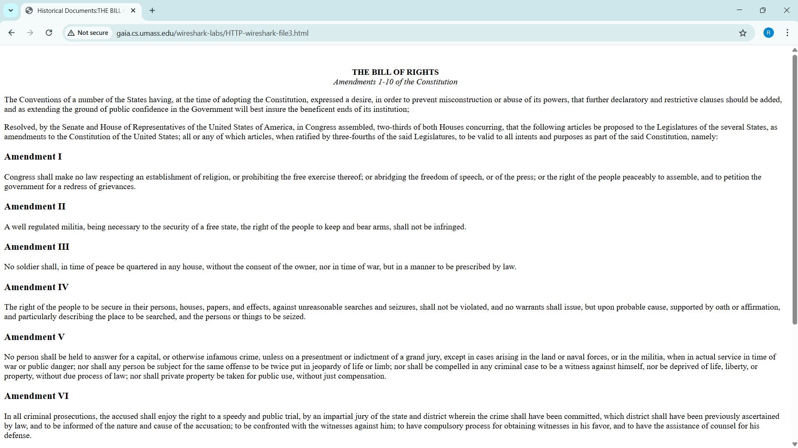
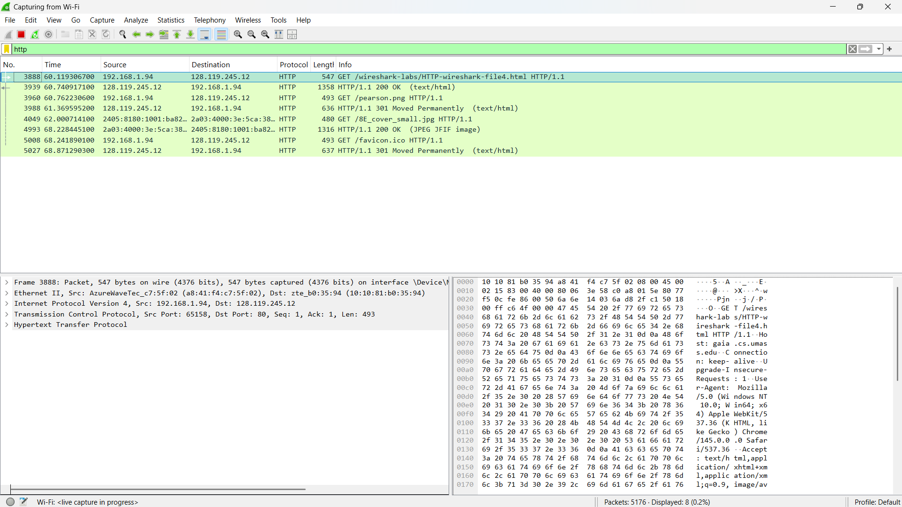
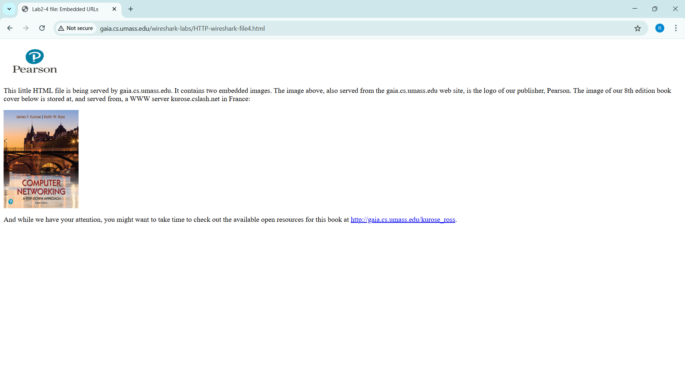
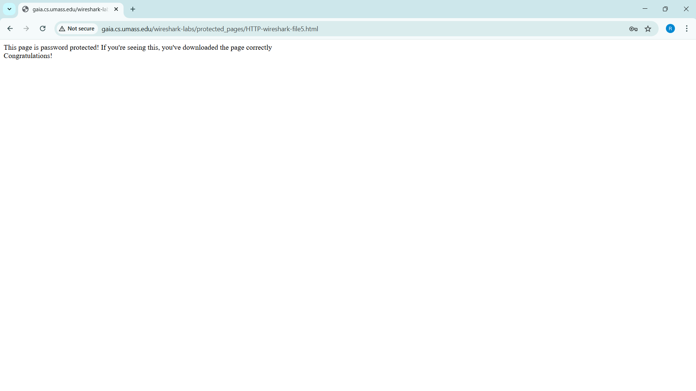
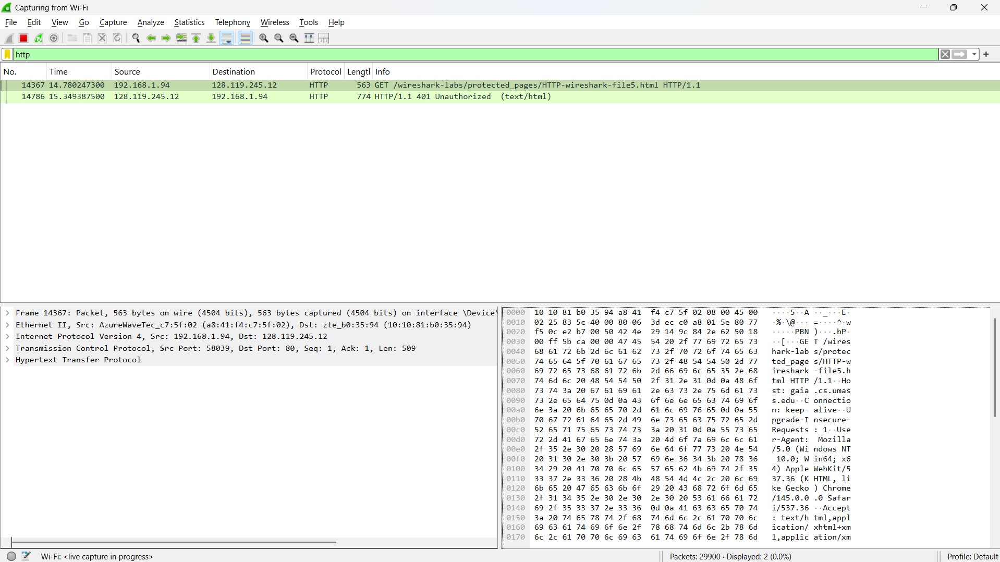
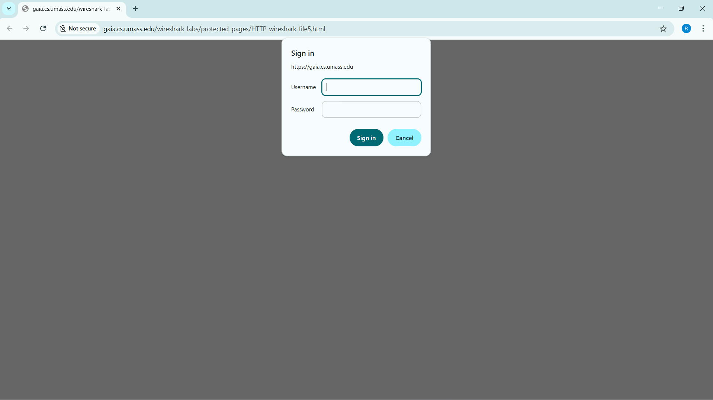
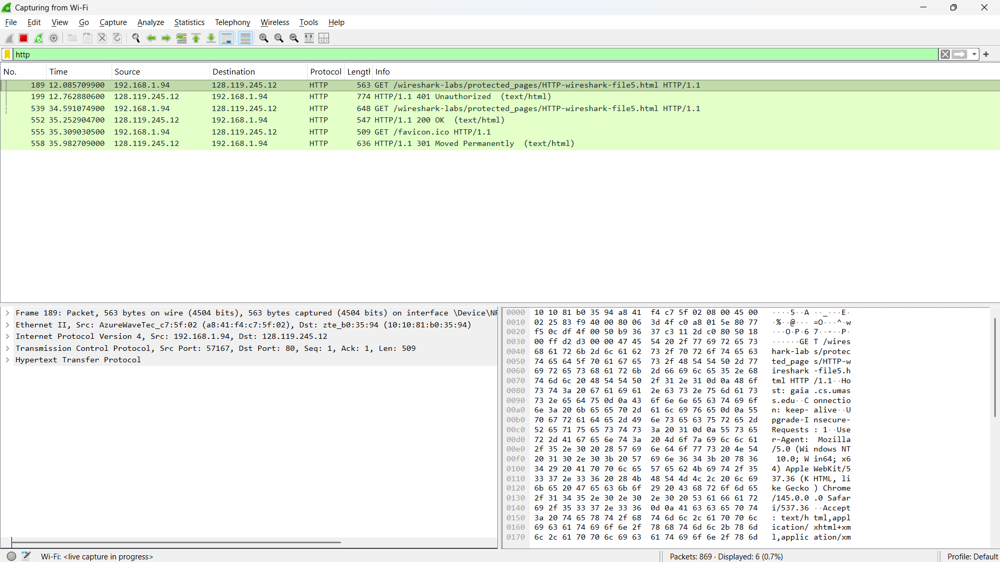

# laporan Praktikum Jaringan komputer 
# Modul 2
## langkah Percobaan
1. 3.2
2. 3.2.1
3. 3.3
4. 3.4
5. 3.5 

## Lampiran
Pertama, buka wireshark pencet dua kali tulisan “wifi”:

## 3.2
Setelah masuk, lalu ketik http

## 3.2.1

## 3.3

## 3.4

## 3.5

