# Laporan Praktikum Jarkom

## Langkah Percobaan
1. 4.2
2. 4.4

## Lampiran 
# MODUL 4
## Soal 4.2 Nslookup
1. Jalankan nslookup untuk mendapatkan alamat IP dari server web di Asia. Berapa alamat IP
server tersebut?
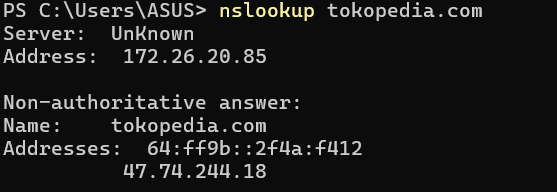

2. Jalankan nslookup agar dapat mengetahui server DNS otoritatif untuk universitas di Eropa.
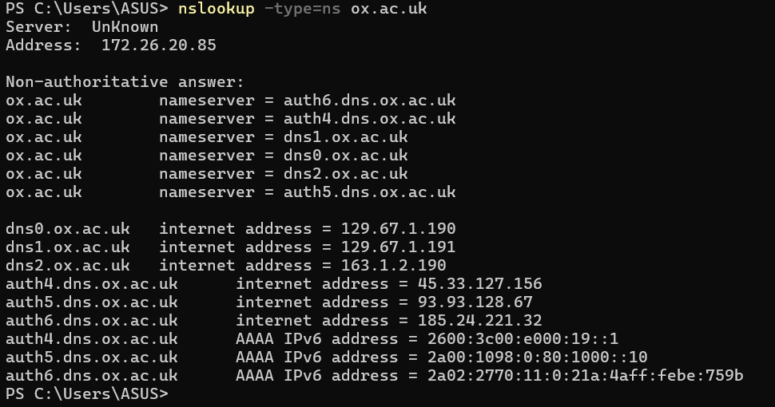

3. Jalankan nslookup untuk mencari tahu informasi mengenai server email dari Yahoo! Mail
melalui salah satu server yang didapatkan di pertanyaan nomor 2. Apa alamat IP-nya? 
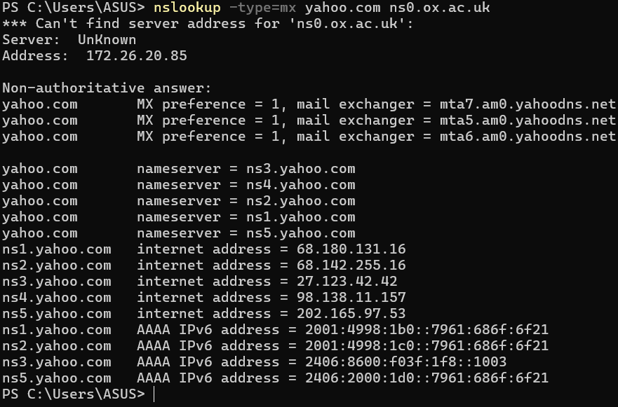

## Soal 4.4 Tracking DNS Dengan Wireshark

# Soal Pertama
1. Cari pesan permintaan DNS dan balasannya. Apakah pesan tersebut dikirimkan melalui UDP
atau TCP? Ya Melalui UDP
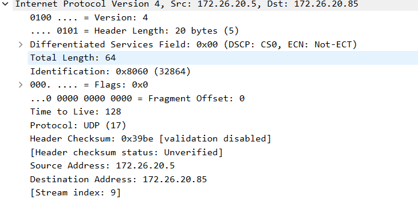

2. Apa port tujuan pada pesan permintaan DNS? Apa port sumber pada pesan balasannya? 
.png) 
.png)

3. Pada pesan permintaan DNS, apa alamat IP tujuannya? Apa alamat IP server DNS lokal anda
(gunakan ipconfig untuk mencari tahu)? Apakah kedua alamat IP tersebut sama?

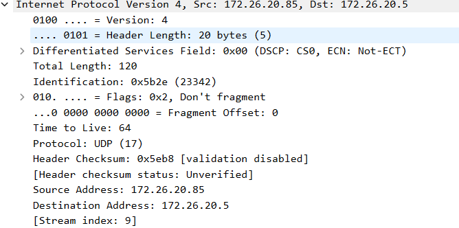

4. Periksa pesan permintaan DNS. Apa “jenis” atau ”type” dari pesan tersebut? Apakah pesan
permintaan tersebut mengandung ”jawaban” atau ”answers”?

TYPE AAAA, IYA MENGANDUNG ANSWERS

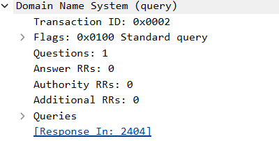

5. Periksa pesan balasan DNS. Berapa banyak ”jawaban” atau ”answers” yang terdapat di
dalamnya? Apa saja isi yang terkandung dalam setiap jawaban tersebut?
ADA 2 ANSWERS
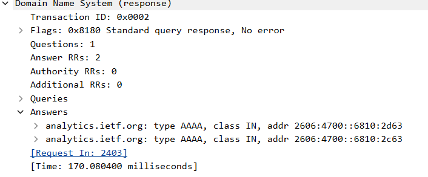

6. Perhatikan paket TCP SYN yang selanjutnya dikirimkan oleh host Anda. Apakah alamat IP
pada paket tersebut sesuai dengan alamat IP yang tertera pada pesan balasan DNS?
IYA

7. Halaman web yang sebelumnya anda akses (http://www.ietf.org) memuat beberapa
gambar. Apakah host Anda perlu mengirimkan pesan permintaan DNS baru setiap kali ingin
mengakses suatu gambar?  
TIDAK PERLU

# Soal Kedua
1. Apa port tujuan pada pesan permintaan DNS? Apa port sumber pada pesan balasan DNS?
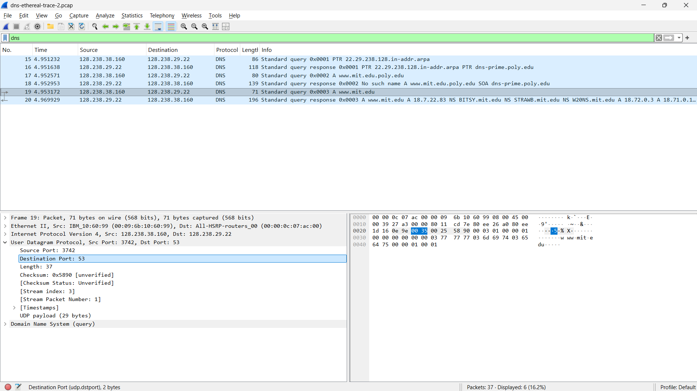

2. Ke alamat IP manakah pesan permintaan DNS dikirimkan? Apakah alamat IP tersebut
merupakan default alamat IP server DNS lokal Anda?
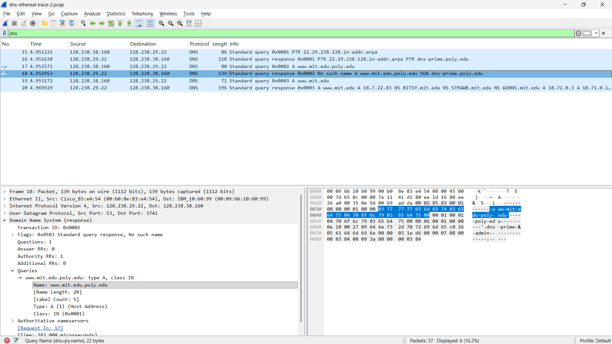

3. Periksa pesan permintaan DNS. Apa ”jenis” atau ”type” dari pesan tersebut? Apakah pesan
tersebut mengandung ”jawaban” atau ”answers”?
TYPE A, TIDAK MENGANDUNG ASNWERS
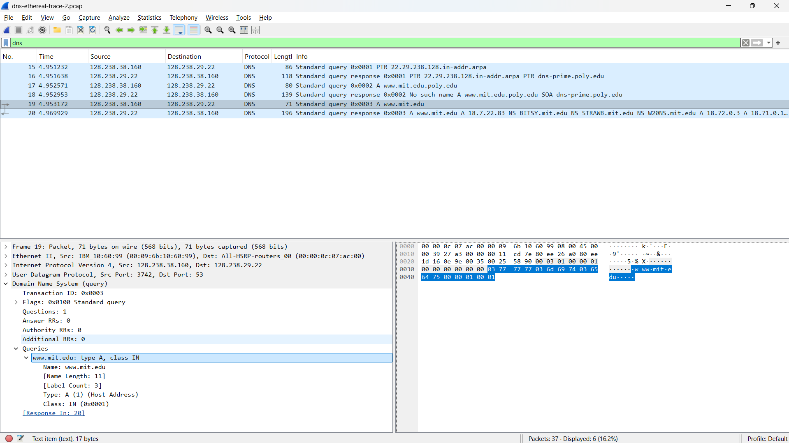

4. Periksa pesan balasan DNS. Berapa banyak ”jawaban” atau “answers” yang terdapat di
dalamnya. Apa saja isi yang terkandung dalam setiap jawaban tersebut? 
ADA SATU ANSWERS
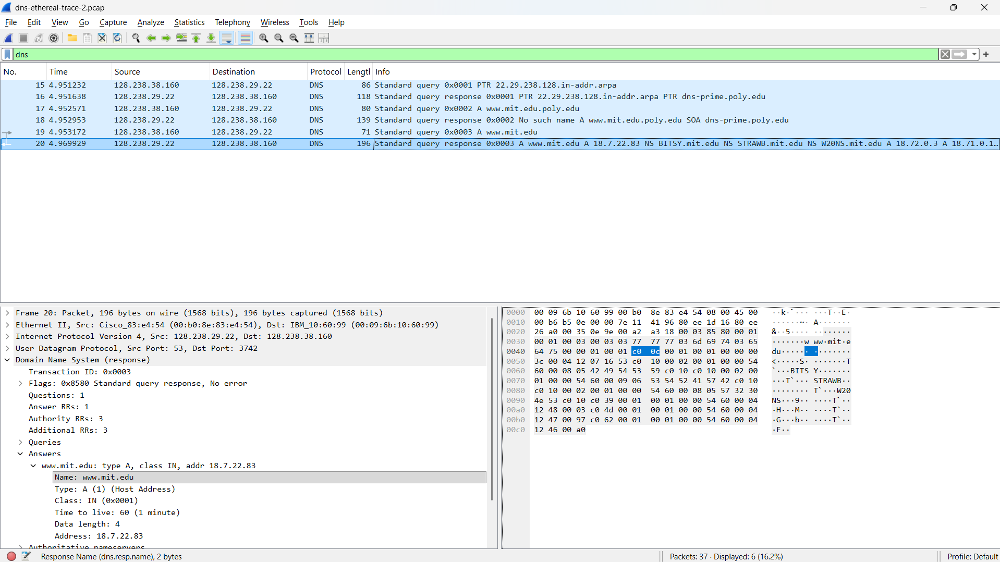

# Soal Ketiga
1. Ke alamat IP manakah pesan permintaan DNS dikirimkan? Apakah alamat IP tersebut
merupakan default alamat IP server DNS lokal Anda?
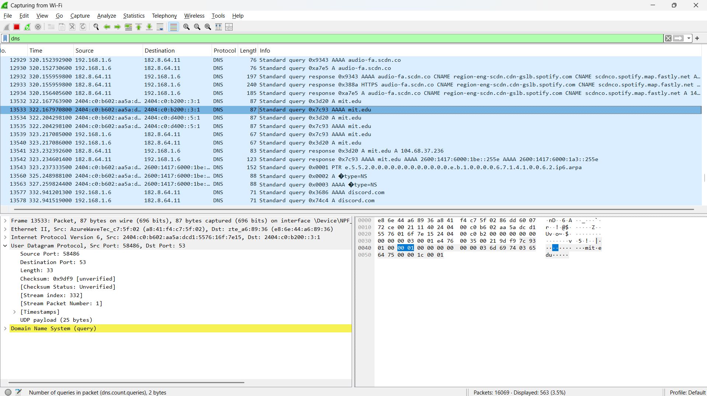

2. Periksa pesan permintaan DNS. Apa ”jenis” atau ”type” dari pesan tersebut? Apakah pesan
tersebut mengandung ”jawaban” atau ”answers”? 
TYPE AAAA, TIDAK MENGANDUNG ANSWERS
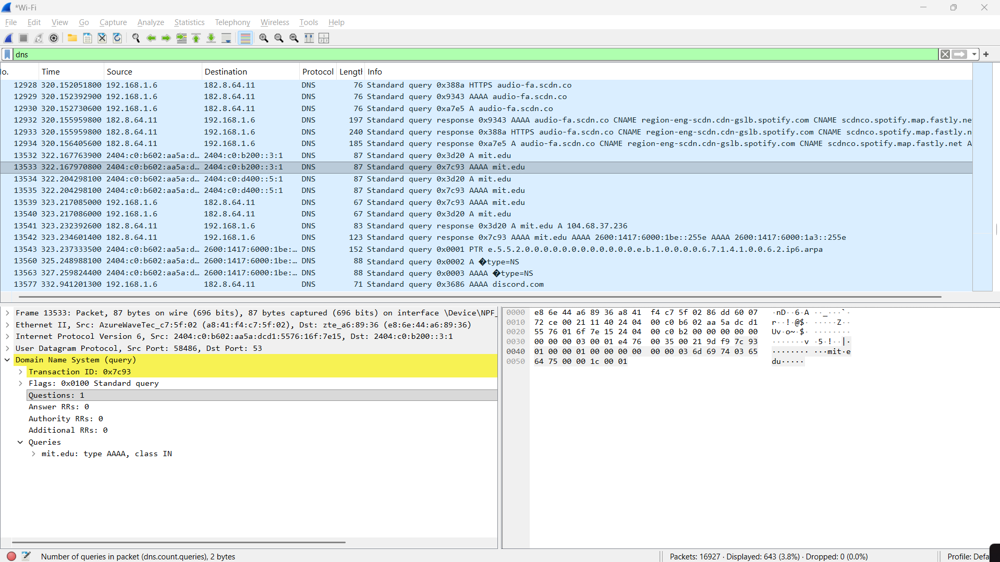

3. Periksa pesan balasan DNS. Apa nama server MIT yang diberikan oleh pesan balasan?
Apakah pesan balasan ini juga memberikan alamat IP untuk server MIT tersebut? 
NAMA SERVER mit.edu , YA MEMBERIKAN ALAMAT IP
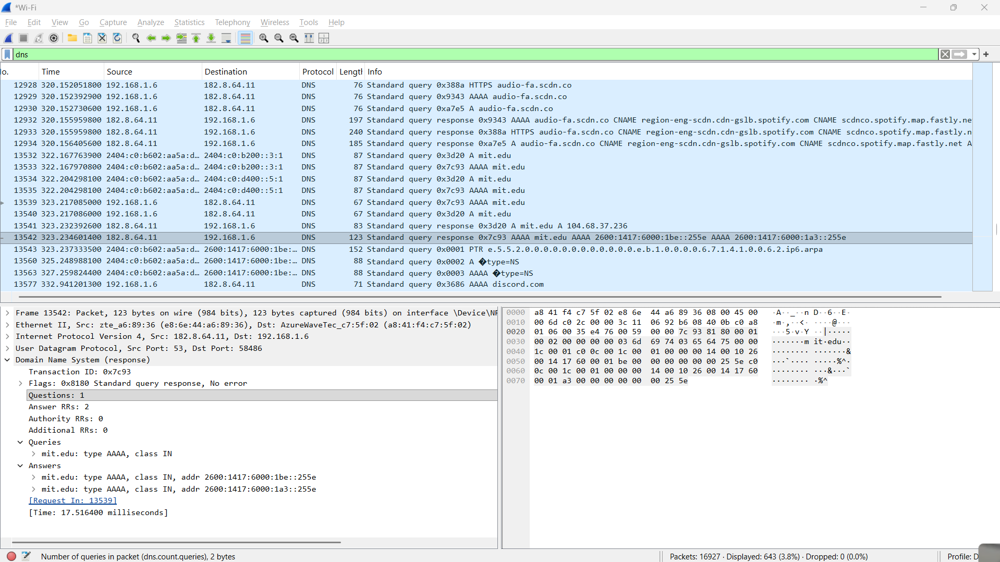

# Soal Keempat
1. Ke alamat IP manakah pesan permintaan DNS dikirimkan? Apakah alamat IP tersebut
merupakan default alamat IP server DNS lokal Anda?
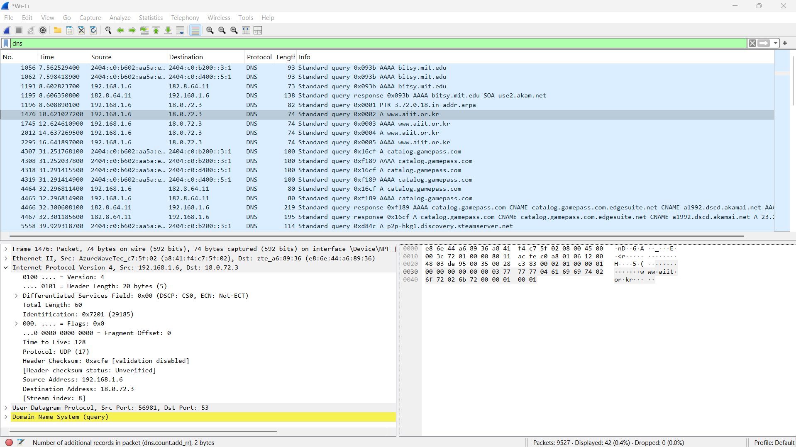

2. Periksa pesan permintaan DNS. Apa ”jenis” atau ”type” dari pesan tersebut? Apakah pesan
tersebut mengandung ”jawaban” atau ”answers”?
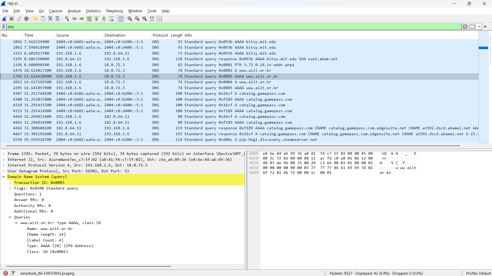

3. Periksa pesan balasan DNS. Berapa banyak ”jawaban” atau “answers” yang terdapat di
dalamnya. Apa saja isi yang terkandung dalam setiap jawaban tersebut?
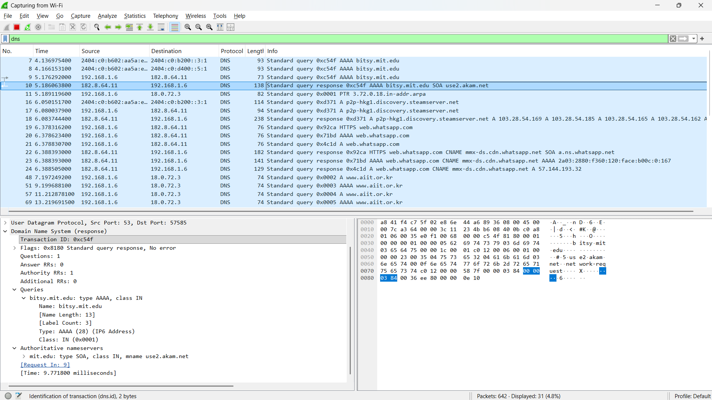

